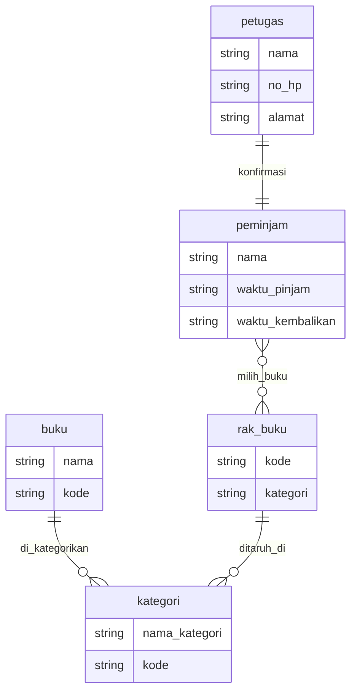

# Database perpustakaan markdown

MArkdown untuk simulasi databse perpustakaan, yang menggunakan entitas buku, kategori, rak buku, petugas dan peminjam

## 📸 Preview

## 🛠️ Tech Stack

**Mermaid**
tech untuk membuat mermaid

**Git** — untuk version control dan kolaborasi
