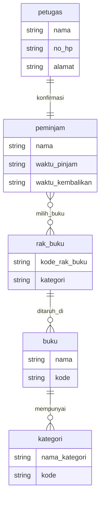

```mermaid
erDiagram
   buku {
        string nama
        string kode
    }

    kategori {
        string nama_kategori
        string kode
    }

    rak_buku {
        string kode_rak_buku
        string kategori
    }
    petugas {
        string nama
        string no_hp
        string alamat
    }
    peminjam {
        string nama
        string waktu_pinjam
        string waktu_kembalikan
    }

    buku ||--o{ kategori : mempunyai
    rak_buku ||--o{ buku : ditaruh_di
    peminjam }O --o{ rak_buku : milih_buku
    petugas || -- || peminjam : konfirmasi

```
